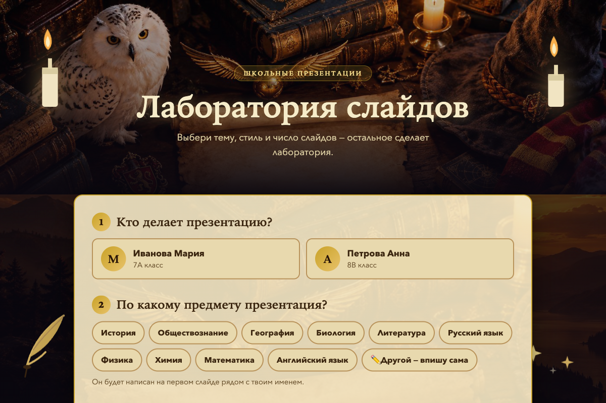
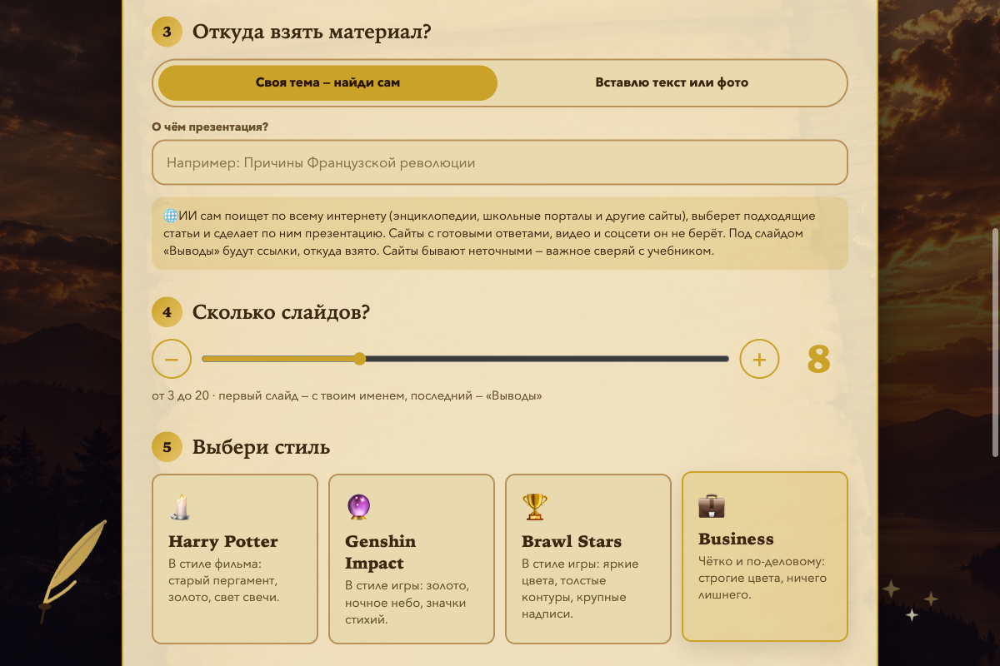
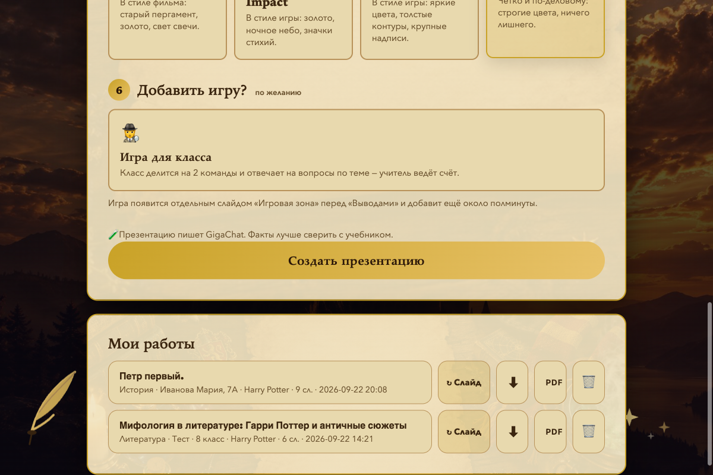
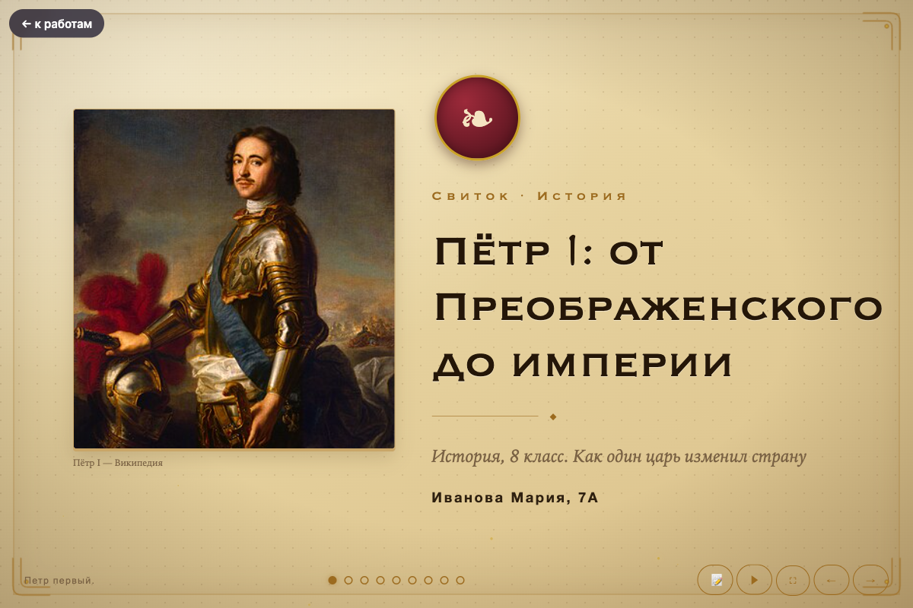
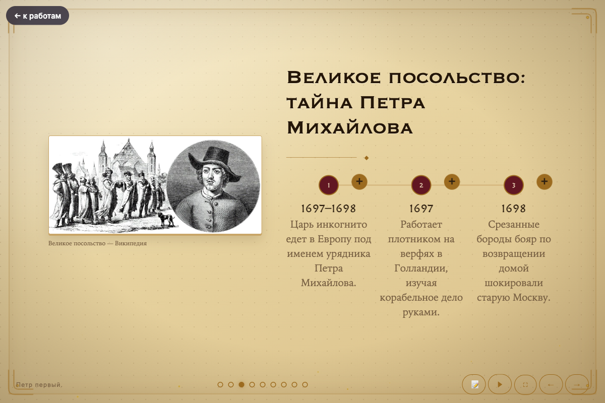
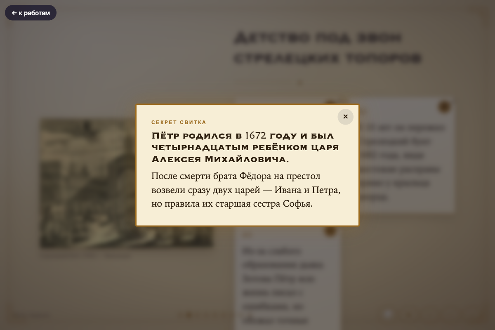
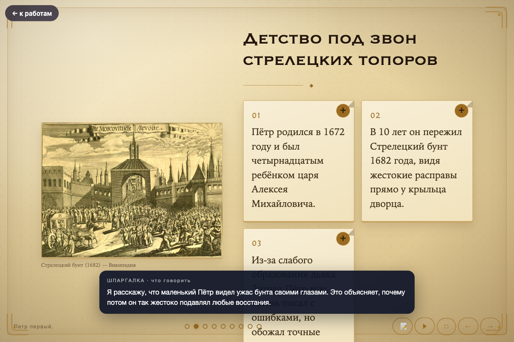
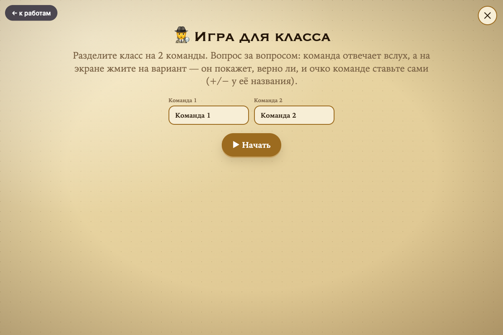
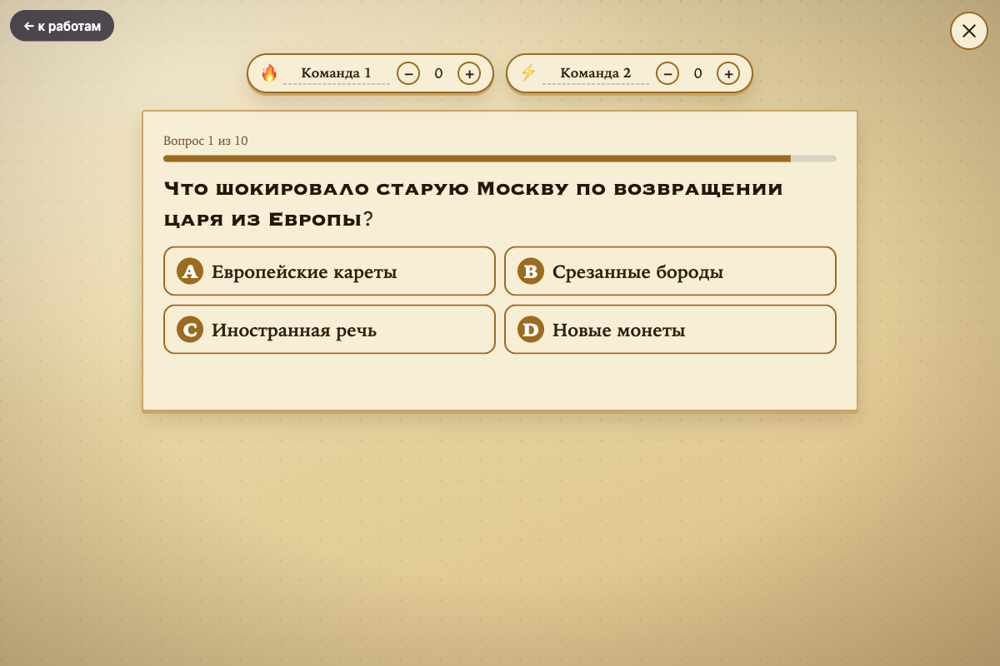

# Лаборатория слайдов

Приложение, в котором школьница за минуту делает красивую презентацию сама: выбирает предмет, тему, число слайдов и стиль — ИИ пишет текст, подбирает картинки и собирает готовый файл.

Сделано для двух дочерей автора (7 и 8 класс) как дипломный проект курса по Claude Code (Zerocoder), вайб-кодингом: заказчик — Анна, разработчик — Claude Code.



## Какую проблему решает

Школьная презентация — выбор из двух плохих вариантов: скучный шаблон или самодельный «мем-ужас», который стыдно показать учителю. Вечер уходит у ребёнка и у родителей. Здесь ребёнок сам выбирает стиль — от делового до любимых игр — и получает результат за 30–60 секунд.

## Что умеет

- **4 стиля оформления:** Harry Potter, Genshin Impact, Brawl Stars, Business. Названия — «в стиле», логотипы и картинки игр и фильма не копируются.
- **Два способа дать материал:** «Своя тема» (ИИ сам ищет по интернету и читает статьи) или «Вставлю текст или фото» (вставить текст или загрузить фото, PDF, Word, TXT).
- **От 3 до 20 слайдов**, 6 раскладок: карточки, схема, лента времени, сравнение, большая цифра, цитата.
- **Картинки на каждом слайде:** тематические (картины, гравюры, карты) или мемы по настроению.
- **Честность:** ИИ не имеет права выдумывать цитаты и цифры — их проверяет код; источники подставляются автоматически и стоят на слайде «Выводы».
- **Шпаргалка выступления** для каждого слайда, всплывающие факты, автопоказ, полный экран. Слайд сам подгоняется под экран планшета или ноутбука (на телефоне — прокручивается).
- **Игра для класса** внутри презентации: две команды отвечают на вопросы по теме, вопросы пишет ИИ.
- **Скачивание:** один HTML-файл (открывается без интернета) или **PDF** для сдачи учителю (около 6 секунд, текст в нём можно выделять и копировать).
- **Работает на планшете и телефоне:** значок на экране, доступ по домашнему Wi-Fi.

## Как это выглядит

Шаги создания (тема, число слайдов, стиль):



Полка «Мои работы»: открыть, переделать слайд, скачать файл или PDF, удалить:



Готовая презентация — первый слайд и слайд с лентой времени:




Всплывающий факт и шпаргалка выступления:




Игра для класса:




*Имена на снимках выдуманные.*

## Как запустить

Нужен Mac (распознавание текста с фото использует встроенные средства macOS) и Python 3.9+.
Для PDF нужен браузер Google Chrome.

```bash
cd laboratoriya-slajdov      # папка проекта
python3 -m venv .venv
.venv/bin/pip install -r requirements.txt
cp students.example.json students.json     # впишите своих учениц
.venv/bin/python -u app.py
```

Программа напечатает два адреса:
- на компьютере: `http://localhost:5050`;
- на планшете в той же Wi-Fi сети: `http://<адрес компьютера>:5050`. Чтобы получить значок на экране: «Поделиться» → «На экран „Домой“».

Остановить: `Ctrl+C`.

### Ключи для ИИ

Ключи лежат вне проекта, в папке `~/.config/klyuchi-zakrytye/` (в репозиторий не попадают):

| Файл | Для чего |
|---|---|
| `gigachat.key` | основной ИИ — GigaChat от Сбера (бесплатный тариф, работает из России без VPN) |
| `russian_trusted_root_ca.pem` | сертификат Минцифры, без него Сбер не открывается |
| `serper.key` | поиск материала по теме (Serper) |
| `anthropic.key` | необязательно: запасной ИИ — Claude (платный, нужен VPN) |

**Без ключей приложение всё равно запускается:** создаёт демо-презентацию с заготовками текста.
Если ИИ не ответил, причина записывается в `ai-errors.log`, а ученице показывается короткая фраза.

## Как устроено

```
Форма → материал → «Сценарист» (ИИ) → проверка → картинки → «Оформитель» → HTML-файл
```

1. **Форма** (`templates/`): ученица, предмет, материал, число слайдов, стиль.
2. **Материал** (`research.py`, `extract.py`, `ocr.swift`): поиск Serper по всему интернету с фильтром мусорных сайтов или чтение вставленного текста и файлов.
3. **Сценарист** (`ai.py`): ИИ пишет структуру презентации строго по схеме; код проверяет цитаты и цифры.
4. **Картинки** (`images.py`): поиск, сжатие, вшивание в файл.
5. **Оформитель** (`generator.py`, `styles/`): «паспорт стиля» + общий движок раскладок собирают один HTML-файл.
6. **PDF** (`pdf.py`): скрытый Chrome «печатает» презентацию — по слайду на лист 16:9, текст в PDF выделяется.

Стек: Python, Flask, HTML/CSS/JavaScript без библиотек, Pillow, GigaChat API, Serper, Chrome (для PDF), Swift + Vision (распознавание фото).

## Приватность

- Имена учениц лежат только в `students.json` (он в `.gitignore`). В репозитории — `students.example.json` с выдуманными именами.
- В ИИ уходят только тема, предмет, класс и текст материала — **без имён детей**.
- Загруженные фото и файлы читаются и сразу удаляются.
- Поиск не открывает адреса внутри домашней сети.

## Что проверено и что нет

Проверено: все стили и раскладки на снимках экрана и в настоящем браузере; живая генерация GigaChat на разных темах (15–65 секунд); поиск материала; загрузка фото, PDF, Word, TXT (тестовые файлы); работа с планшета дочерей.

**Не проверено:**
- запасной ИИ Claude с настоящим ключом;
- распознавание настоящих фото страниц из учебника (тени, изгиб);
- одновременная работа нескольких учениц (у бесплатного GigaChat один поток).

**Известные недочёты:**
- Подпись под картинкой иногда содержит название сайта-стока, а мемы могут попадать на серьёзные темы.
- Факты из интернета и от ИИ могут быть неточными — их нужно сверять с учебником (об этом предупреждает само приложение).

## Что дальше

Мини-редактор слайда, режим репетиции с таймером, работа без ИИ («каркас»), вкладки в приложении, «стиль по картинке», QR-код на работу.

## Описание проекта и скилл

- **Описание проекта** по структуре из урока (название, проблема, пользователь, основная функция, формат результата, MVP, технологии): [`docs/2026-09_diplomnyy-proekt_prezentacii_opisanie.md`](docs/2026-09_diplomnyy-proekt_prezentacii_opisanie.md).
- **Отчёт** — что делали, какие были ошибки и как их исправляли: [`docs/2026-09_diplomnyy-proekt_otchet.md`](docs/2026-09_diplomnyy-proekt_otchet.md).
- **Скилл проекта** для Claude Code: [`.claude/skills/laboratoriya-slajdov/SKILL.md`](.claude/skills/laboratoriya-slajdov/SKILL.md) — как запускать приложение, пересобирать работы, делать PDF и проверять вёрстку. Claude Code подхватывает его сам, если открыть проект в этой папке.

## Лицензия и авторство

Учебный проект. Идеи по презентациям подсмотрены в открытых проектах на GitHub, их код не используется.
